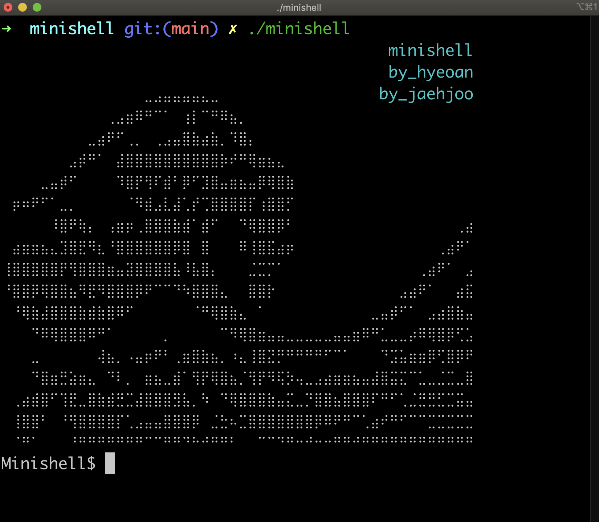
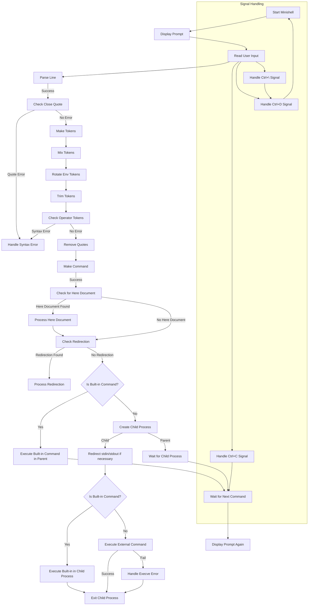

# 🐚 Minishell

bash와 유사한 동작을 하는 간단한 쉘(Shell) 프로그램 만들기.



## ✅ Supported Features

- 프롬프트 표시: 명령어 입력 대기
- 명령어 히스토리 관리 (위/아래 화살표를 이용해 이전 명령어 탐색 가능)
- 경로 기반 실행 파일 검색 및 실행 (절대/상대 경로, PATH 환경 변수 활용)
- 시스템 실행 파일 실행 (예: `ls`, `cat`, `grep` 등)
- 로컬 실행 파일 실행 (`./minishell`)
- **리다이렉션**:
  - `<`: 입력 리다이렉션
  - `>`: 출력 리다이렉션
  - `<<`: 종료 기호를 사용한 입력 리다이렉션 (heredoc)
  - `>>`: 출력 덧붙이기 모드 리다이렉션
- **파이프**: `|`를 이용해 명령어의 출력이 다음 명령어의 입력으로 연결
- **환경 변수 처리**: `$`로 시작하는 변수는 그 값으로 확장
  - `$?`: 가장 최근에 실행된 명령어의 종료 상태로 확장
- **내장 명령어**:
  - `echo`: 문자열 출력 (`-n` 옵션 지원)
  - `cd`: 디렉토리 변경 (상대/절대 경로)
  - `pwd`: 현재 디렉토리 출력
  - `export`: 환경 변수 설정
  - `unset`: 환경 변수 삭제
  - `env`: 환경 변수 목록 출력
  - `exit`: 셸 종료 (옵션 없이 종료 코드만 지원)
- **시그널 처리**:
  - `Ctrl+C`: 새로운 줄에 프롬프트를 다시 표시
  - `Ctrl+D`: 셸 종료
  - `Ctrl+\`: 아무 동작 없음
- **따옴표 처리**:
  - `'` (작은 따옴표): 따옴표 내에서 메타 문자를 해석하지 않음
  - `"` (큰 따옴표): `$`를 제외한 메타 문자를 해석하지 않음

## 🚫 Unsupported Features

Minishell은 다음 기능을 **지원하지 않습니다**:

- `\` (백슬래시)
- `;` (세미콜론)
- `&&` (AND 논리 연산자)
- `||` (OR 논리 연산자)
- 와일드카드 (`*`)

<br>

## 🌊 Flow Chart



- [Parser Flow](./docs/PARSER.md)
- [Signal Flow](./docs/SIGNAL.md)
- [Execution Flow](./docs/EXECUTION.md)

<br>

## ⌨️ 실행 방법

필수 라이브러리 `readline`을 설치 후 진행 해주세요.

1. 프로그램 설치 및 루트 디렉토리로 이동

```shell
git clone https://github.com/GCgang/minishell.git && cd minishell
```

2. 프로젝트 빌드

```shell
make
```

3. Minishell 실행

```
./minishell
```

<br>

## 📂 폴더구조

1. 파싱 라이브러리 생성(pars.a)
2. 실행 라이브러리 생성(exec.a)
3. pars.a와 exec.a를 링크하여 최종 실행 파일 minishell을 생성

```shell
🐚minishell
 ┣ 📂exec
 ┃ ┣ 📂builtin
 ┃ ┃ ┣ 📂cd
 ┃ ┃ ┃ ┣ 📜cd.c
 ┃ ┃ ┃ ┗ 📜cd.h
 ┃ ┃ ┣ 📂echo
 ┃ ┃ ┃ ┣ 📜echo.c
 ┃ ┃ ┃ ┗ 📜echo.h
 ┃ ┃ ┣ 📂env
 ┃ ┃ ┃ ┣ 📜env.c
 ┃ ┃ ┃ ┗ 📜env.h
 ┃ ┃ ┣ 📂exit
 ┃ ┃ ┃ ┣ 📜exit.c
 ┃ ┃ ┃ ┗ 📜exit.h
 ┃ ┃ ┣ 📂export
 ┃ ┃ ┃ ┣ 📜export.c
 ┃ ┃ ┃ ┗ 📜export.h
 ┃ ┃ ┣ 📂pwd
 ┃ ┃ ┃ ┣ 📜pwd.c
 ┃ ┃ ┃ ┗ 📜pwd.h
 ┃ ┃ ┗ 📂unset
 ┃ ┃ ┃ ┣ 📜unset.c
 ┃ ┃ ┃ ┗ 📜unset.h
 ┃ ┣ 📂execute
 ┃ ┃ ┣ 📜execute.c
 ┃ ┃ ┣ 📜execute_built_in.c
 ┃ ┃ ┣ 📜execute_utils.c
 ┃ ┃ ┗ 📜execve_cmd.c
 ┃ ┣ 📂here_doc
 ┃ ┃ ┗ 📜here_document.c
 ┃ ┣ 📂include
 ┃ ┃ ┣ 📜builtin.h
 ┃ ┃ ┣ 📜execute.h
 ┃ ┃ ┣ 📜here_doc.h
 ┃ ┃ ┗ 📜redirection.h
 ┃ ┣ 📂redirection
 ┃ ┃ ┣ 📜process_io_dup.c
 ┃ ┃ ┗ 📜redirection.c
 ┃ ┗ 📜Makefile
 ┣ 📂pars
 ┃ ┣ 📂include
 ┃ ┃ ┗ 📜pars.h
 ┃ ┣ 📂srcs
 ┃ ┃ ┣ 📂command
 ┃ ┃ ┃ ┣ 📜make_com.c
 ┃ ┃ ┃ ┣ 📜pars_com.c
 ┃ ┃ ┃ ┣ 📜record_builtin.c
 ┃ ┃ ┃ ┗ 📜word_cnt.c
 ┃ ┃ ┣ 📂tokenizer
 ┃ ┃ ┃ ┣ 📜chk_close_quote.c
 ┃ ┃ ┃ ┣ 📜chk_oper_token.c
 ┃ ┃ ┃ ┣ 📜env_search.c
 ┃ ┃ ┃ ┣ 📜env_search2.c
 ┃ ┃ ┃ ┣ 📜env_search3.c
 ┃ ┃ ┃ ┣ 📜make_token.c
 ┃ ┃ ┃ ┣ 📜mix_token.c
 ┃ ┃ ┃ ┣ 📜removing_quote.c
 ┃ ┃ ┃ ┣ 📜rotate_env_token.c
 ┃ ┃ ┃ ┗ 📜trim_token.c
 ┃ ┃ ┣ 📂utils
 ┃ ┃ ┃ ┣ 📜pars_list_token_utils.c
 ┃ ┃ ┃ ┣ 📜pars_list_token_utils2.c
 ┃ ┃ ┃ ┣ 📜pars_split_utils.c
 ┃ ┃ ┃ ┣ 📜pars_utils.c
 ┃ ┃ ┃ ┣ 📜pars_utils2.c
 ┃ ┃ ┃ ┗ 📜pars_utils3.c
 ┃ ┃ ┗ 📜pars_line.c
 ┃ ┗ 📜Makefile
 ┣ 📂share
 ┃ ┣ 📜clear_all.c
 ┃ ┣ 📜err_msg.c
 ┃ ┣ 📜exec_signal.c
 ┃ ┣ 📜init.h
 ┃ ┣ 📜init_env.c
 ┃ ┣ 📜init_list_utils.c
 ┃ ┣ 📜init_signal.c
 ┃ ┣ 📜init_utils.c
 ┃ ┣ 📜list_clear_com.c
 ┃ ┣ 📜list_clear_env.c
 ┃ ┣ 📜minishell.c
 ┃ ┗ 📜struct.h
 ┗ 📜Makefile
```

<br>

## Team

| [💻 Atomic](https://github.com/jaehjoo) | [💻 GCgang](https://github.com/GCgang) |
| --------------------------------------- | -------------------------------------- |
| **Parsing**                             | **Execution**                          |
